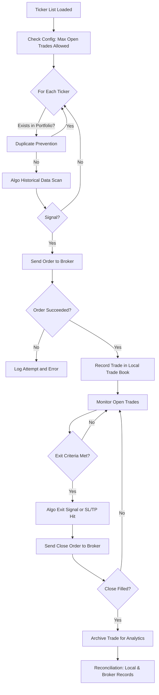

# TradingSystem Requirements

## Table of Contents

1. [Project Overview](#project-overview)
2. [Architectural Structure & Mode Separation](#architectural-structure--mode-separation)
3. [Setup & Broker Connectivity](#setup--broker-connectivity)
4. [User Configuration](#user-configuration)
5. [Mode Selection: Paper and Live](#mode-selection-paper-and-live)
6. [System Pre-Flight & Initialization](#system-pre-flight--initialization)
7. [Trade Monitoring, Reconciliation & Audit](#trade-monitoring-reconciliation--audit)
8. [Trade Recording Logic](#trade-recording-logic)
9. [Common Blockages & Routine Handling](#common-blockages--routine-handling)
10. [Example User Reconciliation Table](#example-user-reconciliation-table)
11. [Workflow Diagram](#workflow-diagram)
12. [Clarification on Trade Book Records](#clarification-on-trade-book-records)
13. [Lightweight Industrial-Grade Practices](#lightweight-industrial-grade-practices)
14. [Glossary](#glossary)
15. [Strategy Framework](#strategy-framework)
16. [Data Management](#data-management)
17. [State Persistence](#state-persistence)
18. [Order Management](#order-management)
19. [Performance Analytics](#performance-analytics)
20. [Configuration Schema](#configuration-schema)
21. [Testing & Promotion Path](#testing--promotion-path)
22. [Position Management](#position-management)
23. [Scheduling & Market Hours](#scheduling--market-hours)
24. [Error Recovery & Resilience](#error-recovery--resilience)

---

## 1. Project Overview

TradingSystem is designed to automate and monitor trading activities. It strictly separates paper (simulation) and live (production) modes for safe and scalable workflow.

---

## 2. Architectural Structure & Mode Separation

- The project **must** be structured into `/paper` and `/live` folders:
    - `/paper`: For simulation/backtesting only. No real trades sent.
    - `/live`: For production trading with real brokers and funds.
    - `/common` (or equivalent): For code/resources shared between the modes.
- Each mode shall have separate trade books, logs, and executions. No mixing of data.
- Only parameter sets proven and approved in paper mode may be promoted to live mode.

---

## 3. Setup & Broker Connectivity

### 0.1 Broker API Discovery & Connection

1. User supplies broker name. System finds/validates API documentation and guides credential entry.
2. System tests connection, fetches sample data, and stores broker connection profile if successful. Prompts for manual URL if broker is unknown.

- API credentials must be stored in encrypted form.

---

## 4. User Configuration

### 0.2 User Configuration for Trading

- Select tickers, strategy, and risk/position limits.
- Set up notifications/logging.
- Advise on compliance, if needed.

---

## 5. Mode Selection: Paper and Live

- User **must** choose "paper" or "live" at startup.
- All operations, logs, and books are kept separate by mode.
- The paper trading module only simulates fills (never sends real broker orders) and focuses on recording performance metrics.
- The live module executes actual trades using the broker API and only with parameter sets that have demonstrated acceptable results in paper mode.

---

## 6. System Pre-Flight & Initialization

### 0.3 System Pre-Flight Check

- Run a connection/permission test and dry-run trade to validate before starting live trading.
- Reconcile supported order types, tickers, etc.

---

## 7. Trade Monitoring, Reconciliation & Audit

- All system trades logged locally with timestamps and metadata.
- System regularly fetches broker and local trades for comparison.
- If trades exist in broker only, mark as "discovered/manual" and list in UI/report.
    - Extra position ("broker: 3, local: 2") triggers a discovered/manual entry for discrepancy.
- Allow user to annotate or adopt discovered/manual trades in the trade book.
- Track/reconcile both by trade records and by position (quantity per symbol).
- Notify user/admin only when mismatches persist or action is needed.
- Write operations on trade logs and the trade book must be append-only (no silent modifications).
- All trade and log entries must use accurate, synchronized timestamps.

---

## 8. Trade Recording Logic

- After sending an order to the broker, the system MUST check the broker's response.
- Only orders confirmed as "filled" or "succeeded" by the broker are recorded in the local trade book.
- Any order attempt that is not successful (e.g., rejected, failed, timeout) MUST be logged with the broker's response and error, and MUST NOT update or create an entry in the local trade book.
- This ensures the local trade book always accurately reflects only actual, broker-confirmed trades.
- Each trade/order must include a unique idempotency key to prevent accidental duplicates.
- After submitting an order, persist its submission status until a broker "filled/succeeded" response is received and logged.

---

## 9. Common Blockages & Routine Handling

- Broker API connection fails – prompt for new credentials/retry later.
- API rate limits – batch/sleep, alert if persistent.
- Manual trades at broker – flag as discovered/manual in UI.
- Partial fills/multi-leg orders – aggregate fills; prompt for review on mismatch.
- Temporary network/API outage – retry, alert if lasting.
- Small data differences – allow simple price/time tolerance in matching.
- A manual kill-switch must be available to halt trading immediately if needed.
- If a trade attempt is far outside normal ranges ("fat finger"), system must reject it or require extra confirmation.
- Important events (broker disconnect, failed order, risk breach) must generate an alert or visible UI warning.

---

## 10. Example User Reconciliation Table

| Symbol | Broker Pos | Local Pos | Discovered Manual | Status                      | System Solution / Behavior                                                                           |
|--------|------------|-----------|-------------------|-----------------------------|---------------------------------------------------------------------------------------------------------|
| AAPL   | 3          | 2         | 1                 | Imbalance                   | Suggest adoption of discovered trade; system updates local book to match broker upon user approval.   |
| MSFT   | 0          | 0         | 0                 | Reconciled                  | No action needed.                                                                                     |
| TSLA   | 4          | 1         | 3                 | Broker Extra Positions      | System auto-adopts extra broker trades or alerts user to annotate/adopt as manual, updates local book to reconcile. |
| AMZN   | 2          | 2         | 0                 | Fully Matched               | No action needed.                                                                                     |
| GOOGL  | 0          | 2         | 0                 | Local Book Overstated       | System auto-identifies 2 unmatched local trades, removes/archives them, syncs Local Pos to 0, logs action for audit; broker is truth. |
| NFLX   | 5          | 4         | 1                 | Partial Match/Unaligned     | System prompts review of unmatched broker trades or fills, auto-adopts or archives per policy.        |
| NIO    | 1          | 0         | 1                 | Discovered at Broker        | System auto-adopts broker trade to local book or flags for review.                                   |
| BABA   | 3          | 3         | 0                 | Reconciled                  | No action needed.                                                                                     |
| META   | 0          | 1         | 0                 | Local Position Missing at Broker | System detects 1 unmatched local trade, removes/archives it, syncs Local Pos to 0, all changes logged. |
| NVDA   | 6          | 5         | 1                 | One Trade Not Synced        | System attempts auto-adopt and logs/alerts if unresolved; user review may be required.               |
| XOM    | 0          | 5         | 0                 | All Local Only, Missing @ Broker | System auto-removes/archives all 5 unmatched local trades, sets Local Pos=0, logs all changes.      |
| ZM     | 8          | 7         | 1                 | Broker Shows More Than Local | System attempts to auto-adopt broker extra or prompts user for manual adoption; local updated to 8.  |
| SONY   | 2          | 0         | 2                 | Manual Trades at Broker Only | System detects 2 broker-only trades, auto-adopts or alerts user for annotation; local is updated.    |
| XYZ    | 5          | 7         | 0                 | Local Greater Than Broker   | System auto-removes/archives 2 unmatched local trades, reduces Local Pos to 5, logs for audit; broker is always the source of truth. |

**Status Column Explanations**

- **Imbalance**: Broker has more than local, source must be found or adopted.
- **Reconciled**: Both positions agree.
- **Broker Extra Positions**: Broker shows more positions than local trade book.
- **Fully Matched**: Perfect agreement.
- **Local Book Overstated**: Local thinks there are positions, but broker shows none for that symbol; system automatically removes/archives extra from local.
- **Partial Match/Unaligned**: Most positions matched, but one or more positions only at broker or local. System auto-adopts or archives accordingly.
- **Discovered at Broker**: Position found at broker, not locally; system adopts to local book or flags for manual review.
- **Local Position Missing at Broker**: System finds position only in local, removes/archives as needed to match broker.
- **One Trade Not Synced**: System tries auto-adopt; alerts if unresolved.
- **All Local Only, Missing @ Broker**: System removes/archives all unmatched local positions to match broker.
- **Broker Shows More Than Local**: System adopts or prompts user to sync local with broker.
- **Manual Trades at Broker Only**: System adopts broker-only trades to local book.
- **Local Greater Than Broker**: System removes/archives unmatched local trades until positions match broker; all actions are audited.

---

## 11. Workflow Diagram



---

## 12. Clarification on Trade Book Records

- The local trade book records only trades that have been successfully executed and accepted by the broker (e.g., filled or confirmed trades).
- Failed or rejected trade attempts are not recorded in the local trade book, but are logged separately for audit and troubleshooting purposes.
- Logging must include all trade submission attempts, responses, and reasons for failure, but only successful trades update the trade book, trigger monitoring, or enter reconciliation routines.

---

## 13. Lightweight Industrial-Grade Practices

- API credentials must be encrypted.
- All logs and trade book updates are append-only and timestamped.
- Unique idempotency key on all orders to prevent race condition and replay.
- Paper/live split in logic, records, deployment.
- Manual kill switch available in live mode.
- Fat-finger checks present on all order entry.

---

## 14. Glossary

- **Paper Trading**: Simulation mode, no real trades, used for analytics and strategy validation.
- **Live Trading**: Real trades, risk automation, and alerting with broker integration.
- **Idempotency Key**: A unique identifier for each order to prevent duplicate execution.
- **Trade Book**: The official record of executed trades—must be separate for each mode.
- **Fat-finger check**: Protection against trades entered far outside reasonable sizes or prices.

---

## 15. Strategy Framework

**Implementation Location**: `/algo_scan/` folder

### 15.1 Algorithm Signal Generation

- **File**: `algo_scan/algo_scan.py`
- Strategy loads historical data and scans for entry/exit signals
- Signal generation must return clear BUY/SELL/HOLD decisions
- Signals include metadata: entry_price, stop_loss, take_profit, position_size, confidence_score
- Each signal must be timestamped and logged for audit trail

### 15.2 Strategy Abstraction

- **File**: `algo_scan/strategy_folder/standard_strategy.py` (template/base class)
- All strategies inherit from common base interface
- Strategy must implement: `generate_signal(ticker, historical_data)` → signal_dict
- Strategy configuration parameters externalized (not hardcoded)
- Strategy version control for A/B testing and rollback

### 15.3 Entry & Exit Logic

- Entry signals trigger order submission (after risk checks pass)
- Exit signals triggered by:
  - Algorithm stop-loss hit
  - Algorithm take-profit hit
  - Manual signal (user intervention)
  - Risk limits breached (position too large, portfolio exposure exceeded)
- Exit orders must close exact trade quantity (not approximate)

### 15.4 Backtesting & Validation

- Backtest framework validates strategy on historical data before paper trading
- Backtest metrics: win rate, profit factor, max drawdown, Sharpe ratio
- Paper trading runs strategy for minimum N trades before live promotion
- Minimum performance thresholds required for live: win_rate >= 50%, profit_factor >= 1.5
- Live promotion requires manual sign-off after reviewing paper results

### 15.5 Paper-to-Live Strategy Promotion

- Strategy must be "proven" in paper mode before live deployment
- Promotion workflow: paper validation → manual review → staged rollout
- Staged rollout: start with 1% position size, scale to 100% over defined period
- Automatic rollback if live strategy deviates from paper performance by >20%

---

## 16. Data Management

**Implementation Location**: Market data provider module (to be created)

### 16.1 Market Data Sourcing

- **Real-time feeds**: Connect to broker data streams or 3rd party providers (IEX, Alpha Vantage, Polygon, etc.)
- **Historical data**: Fetch from broker or data provider for backtesting and recent history
- **Data validation**: Timestamp ordering, gap detection (missing bars), outlier detection
- **Data quality**: Handle splits, dividends, and other corporate actions
- **Fallback strategy**: Switch providers if primary feed fails

### 16.2 Caching Strategy

- **In-memory cache**: Store recent bars (last 1000) for low-latency access
- **Disk cache**: Store historical data locally to reduce API calls
- **Cache invalidation**: Update cache on new bar, refresh stale data every N minutes
- **Cache structure**: Organize by ticker and timeframe (TICKER_TIMEFRAME)
- **Snapshot consistency**: Ensure all algos see same market data within 1-second window

### 16.3 Data Feed Architecture

- **Async data fetching**: Non-blocking market data retrieval to prevent order delays
- **Watchlist management**: Track active tickers and subscription status
- **Multi-feed support**: Simultaneously subscribe to real-time and minute-bar feeds
- **Feed error handling**: Retry logic, exponential backoff, circuit breaker
- **Feed latency monitoring**: Track and alert if delays exceed SLA (must be <100ms)

### 16.4 Historical Data API

- **Date range queries**: Fetch bars from any start/end date with configurable timeframe
- **Timeframe support**: 1min, 5min, 15min, 1hour, daily, weekly
- **Data alignment**: Ensure bars align to market trading schedule (skip weekends, holidays)
- **Data completeness**: Log and report missing data; skip incomplete periods in analysis

### 16.5 Data Storage

- **Local storage location**: Cache directory separate from application code
- **Format**: CSV or SQLite for easy inspection and recovery
- **Retention**: Keep minimum 2 years of daily data, last 6 months of tick data
- **Archival**: Compress old data, maintain restore capability

---

## 17. State Persistence

**Implementation Location**: `/tradebook/` folder (local database)

### 17.1 Trade Book Database Schema

**Primary Storage**: SQLite database in `/tradebook/trades.db` (separate for paper and live)

**Tables**:
- `trades`: id, mode (paper/live), ticker, entry_time, entry_price, qty, exit_time, exit_price, status, trade_id, idempotency_key
- `positions`: id, mode, ticker, total_qty, avg_cost, realized_pnl, unrealized_pnl, last_updated
- `orders`: id, mode, trade_id, broker_order_id, status (submitted, filled, rejected), timestamp, price, qty, response_text
- `logs`: id, mode, timestamp, level (INFO/WARN/ERROR), message, context
- `config`: key, value, mode, last_updated

### 17.2 Position Tracking (By Trade, Not Lump Sum)

**CRITICAL**: System tracks positions **per individual trade**, not aggregated by ticker

Example for ticker AAPL:
- Trade #101: Buy 1 AAPL @ $150 → cost_basis=$150, pnl=(current-150)*1
- Trade #102: Buy 2 AAPL @ $155 → cost_basis=$310, pnl=(current-155)*2
- Trade #103: Sell 1 AAPL @ $160 → realized_pnl=(160-150)*1=$10, archived

System calculates:
- **Per-trade P&L**: Individual trade profitability
- **Total AAPL position**: 2 shares (from trades #101 and #102)
- **Aggregate cost basis**: ($150 + $310) / 3 = $153.33 (if all held)
- **Average entry price**: Per-trade, not averaged across all AAPL trades

### 17.3 Append-Only Logging

- All changes to trade book MUST be append-only (no updates/deletes of existing records)
- Corrections logged separately with reason/timestamp
- Original record remains with `corrected_by_id` reference
- Enables full audit trail and conflict resolution

### 17.4 Crash Recovery & State Reconstruction

- On system startup, load last known state from database
- Compare local trade book with broker positions
- Reconciliation logic resolves differences (see Section 7)
- Incomplete orders from last session: retry or mark failed
- Recover in-flight trade status from broker before resuming trading

### 17.5 Data Backup & Retention

- Automatic daily backup of tradebook database
- Backup location: `/tradebook/backups/` with timestamp
- Keep minimum 30 days of backups
- Transaction logs enable point-in-time recovery if needed
- Monthly archive of closed trades for analytics

---

## 18. Order Management

**CRITICAL PRINCIPLE**: Only successfully executed orders are recorded in trade book. All failures logged separately.

### 18.1 Order Submission & Tracking

- Generate unique idempotency_key for every order (prevent duplicate execution)
- Submit order to broker with request timestamp
- Persist order submission status (submitted, awaiting confirmation)
- Poll broker for order status until filled or rejected
- **ONLY on broker confirmation of filled/succeeded**: Record trade in trade book

### 18.2 Success Criteria for Trade Book Recording

Order is recorded in trade book ONLY IF:
- ✅ Broker API returns "filled" or "succeeded" status
- ✅ Order idempotency_key matches what was submitted
- ✅ Filled quantity matches (or partial fill if allowed per strategy)
- ✅ Fill timestamp is accurate (use broker timestamp, not system time)

Order is NOT recorded (logged to error log instead) IF:
- ❌ Broker rejects order (insufficient funds, invalid symbol, margin call, etc.)
- ❌ Order times out (no response after N seconds)
- ❌ Broker returns error response (500, rate limit, API down)
- ❌ Network failure during order submission
- ❌ Fat-finger check fails (size/price out of bounds)

### 18.3 Order Types & Modifications

- **Supported order types**: Market, Limit, Stop-Loss, Take-Profit
- **Order modification**: Only allow if order not yet filled
  - Modify: quantity, limit price, stop price
  - Requires new idempotency key for modified order
  - Old order must be explicitly cancelled first
- **Order cancellation**: Cancel open orders with broker before reconciliation
- **Partial fills**: Log each partial fill separately; aggregate to match total quantity

### 18.4 Trade Closure Logic

- **Exit orders**: Submit close order for exact trade quantity
- **Matching**: Match exit order to specific trade via trade_id (not ticker aggregate)
- **Exit validation**: Ensure exit order fills; if partial/rejected, log and alert
- **Trade archival**: Move closed trade to archive table after successful exit and reconciliation

### 18.5 Order Error Handling

- **Insufficient funds**: Alert user; prevent order submission; suggest position reduction
- **Invalid symbol/ticker**: Validate ticker before order submission
- **Margin call**: Check buying power; apply margin requirements; alert user
- **Rate limit**: Queue order; retry with exponential backoff (1s, 2s, 4s, ...)
- **Network timeout**: Log attempt; mark as "awaiting confirmation"; poll broker on next cycle
- All errors logged with: timestamp, error_code, broker_response, trade_id, action_taken

---

## 19. Position Management

**CRITICAL**: System manages positions **per trade**, not by ticker lump sum. Each trade tracked individually.

### 19.1 Per-Trade Position Tracking

Example: Ticker AAPL with 3 trades
```
Trade #101: BUY 1 AAPL @ $150  → status=open, pnl=(current-150)*1
Trade #102: BUY 2 AAPL @ $155  → status=open, pnl=(current-155)*2
Trade #103: SELL 1 AAPL @ $160 → status=closed, realized_pnl=+$10
```

**Aggregated position**: 
- Total quantity: 2 (1 from #101, 1 from #102 still open)
- Aggregate cost basis: ($150 + $155) / 2 = $152.50
- Individual tracking enables per-trade P&L analysis and risk management

### 19.2 Real-Time P&L Calculation

**Per-trade P&L**: (current_price - entry_price) × quantity
- Update every tick (real-time feed update)
- Include commission/fees in cost basis for accuracy

**Realized P&L**: Calculated at trade exit
- (exit_price - entry_price) × quantity - 2×commission
- Locked in at trade close, never changes

**Unrealized P&L**: Sum of all open trades at current prices
- Updates in real-time as market moves
- Used for risk management and position alerts

### 19.3 Position State Machine

Each position moves through states:
1. **Open**: Entry order filled; monitoring for exit signals
2. **Closing**: Exit order submitted; awaiting broker confirmation
3. **Closed**: Exit order filled; trade archived
4. **Disputed**: Position in local book doesn't match broker (reconciliation pending)

### 19.4 Risk Metrics Per Position

Monitor continuously:
- **Current P&L**: Unrealized gain/loss
- **Portfolio exposure**: % of total capital in this trade
- **Correlation risk**: Exposure to correlated symbols
- **Drawdown**: Max loss from entry to current price
- **Leverage ratio**: If using margin (position_value / account_equity)

### 19.5 Position Limits & Constraints

- **Max position size per trade**: X% of account (configurable)
- **Max open trades**: N trades max per strategy/account
- **Max sector exposure**: Limit tech sector to Y% of portfolio
- **Max correlation exposure**: No more than Z% in highly correlated symbols
- **Margin requirement**: Maintain min 30% excess buying power
- **Daily loss limit**: Halt trading if daily loss exceeds threshold

### 19.6 Position Averaging Strategy

When adding to position (buying same ticker multiple times):
- Each buy is logged as separate trade with its own entry price
- Cost basis calculated as weighted average ONLY for reporting
- P&L tracking remains per-trade (not averaged)
- Exit logic can close trades individually or in FIFO/LIFO order (configurable)

---

## 20. Performance Analytics

**Implementation Location**: `/analytics/` folder

### 20.1 Trade Performance Metrics

**Per-Trade Metrics**:
- Entry/Exit price and time
- Commission and fees
- Realized P&L (absolute and %)
- Trade duration (days held)
- Max adverse excursion (MAE) - worst price during trade
- Max favorable excursion (MFE) - best price during trade

**Aggregate Metrics**:
- **Win rate**: % of profitable trades
- **Profit factor**: Gross profit / Gross loss (target: >1.5)
- **Average win**: Mean P&L of profitable trades
- **Average loss**: Mean P&L of losing trades
- **Risk/reward ratio**: Avg loss / Avg win
- **Largest win/loss**: Max single trade P&L

### 20.2 Portfolio Performance Metrics

- **Total return**: (Ending capital - Starting capital) / Starting capital
- **Sharpe ratio**: Excess return / volatility (risk-adjusted return)
- **Sortino ratio**: Excess return / downside volatility (penalizes down moves only)
- **Calmar ratio**: Annual return / max drawdown
- **Max drawdown**: Peak-to-trough decline during period
- **Drawdown duration**: Days to recover from max drawdown
- **Win/Loss streaks**: Longest consecutive wins and losses

### 20.3 Performance Reporting

- **Daily reports**: Summary of all trades closed in day, running P&L
- **Weekly reports**: Performance by strategy, by symbol, correlation analysis
- **Monthly reports**: Full performance suite, comparison to benchmarks, risk metrics
- **Comparison to benchmark**: SPY, QQQ, or user-selected benchmark
- **PDF export**: Formatted reports with charts and tables
- **CSV export**: Raw trade and position data for external analysis

### 20.4 Backtesting Framework

- **Walk-forward testing**: Test strategy on out-of-sample data
- **Metrics calculation**: Apply same metric suite to backtest results
- **Drawdown analysis**: Understand worst-case scenarios
- **Parameter sensitivity**: Test how results change with parameter variations
- **Monte Carlo simulation**: Randomize trade order; test robustness
- **Comparison**: Paper results vs backtest; live results vs paper

### 20.5 Analytics Dashboard

- **Real-time display**: Current positions, P&L, open trades
- **Historical view**: Period selection (1 week, 1 month, YTD, all)
- **Charts**: Equity curve, drawdown chart, trade P&L distribution
- **Trade list**: Sortable/filterable table of all trades
- **Heatmap**: Performance by symbol, by day of week, by hour
- **Risk dashboard**: Portfolio exposure, margin usage, concentration

### 20.6 Performance Archives

- Store all historical performance data (never delete)
- Archive daily snapshots: date, end-of-day positions, P&L, metrics
- Enable time-series analysis: How did metrics change over time?
- Retention: Minimum 5 years of historical data

---

## 21. Configuration Schema

### 21.1 Configuration File Structure

**Location**: `/config/` folder with environment-specific files

**Files**:
- `config/base.yaml` - Common settings for all modes
- `config/paper.yaml` - Paper-specific overrides
- `config/live.yaml` - Live-specific overrides (encrypted for sensitive data)
- `config/strategies/` - Individual strategy parameter files

**Format**: YAML (human-readable, versionable in git)

### 21.2 Base Configuration Parameters

```yaml
# Broker & Account
broker: "alpaca"
account_type: "paper"  # or "live"
api_key: "${BROKER_API_KEY}"  # Environment variable
secret_key: "${BROKER_SECRET_KEY}"

# Trading Limits
max_open_trades: 10
max_position_size_pct: 5  # Max 5% of account per trade
daily_loss_limit: 1000  # Max daily loss in dollars
margin_requirement: 0.30  # Min 30% excess buying power

# Data Settings
data_provider: "alpaca"
market_hours: "09:30-16:00"  # EST trading hours
pre_market_enabled: false
after_hours_enabled: false

# System Settings
timezone: "US/Eastern"
logging_level: "INFO"
crash_recovery_enabled: true
```

### 21.3 Strategy-Specific Configuration

**Each strategy has own parameter file**:

```yaml
# strategies/ma_crossover.yaml
strategy_name: "ma_crossover"
enabled: true
version: "1.0"

parameters:
  fast_ma_period: 10
  slow_ma_period: 30
  entry_threshold: 0.01  # 1% above MA
  position_size: 100  # shares per trade
  stop_loss_pct: 2.0
  take_profit_pct: 5.0

watchlist:
  - AAPL
  - MSFT
  - GOOGL
  - TSLA

# Paper vs Live overrides
paper:
  position_size: 50  # Half size in paper
live:
  position_size: 100
  enabled: false  # Start disabled; enable after approval
```

### 21.4 Configuration Validation

- Required fields validation (broker, account_type, etc.)
- Type checking (integers for limits, floats for percentages)
- Range validation (max_position_size must be 0-100%)
- Strategy dependencies (all watchlist tickers must be valid)
- Broker compatibility (validate API endpoint exists)
- Fail fast: Report all config errors on startup

### 21.5 Multi-Strategy Setup

- System supports multiple strategies running simultaneously
- Each strategy gets separate trader instance
- Strategies share data feeds but not positions
- Global position limits apply across all strategies
- Strategy load/unload without system restart (hot reload if possible)

### 21.6 Environment-Specific Settings

| Setting | Paper | Live |
|---------|-------|------|
| API Key | Sandbox/demo key | Real API key (encrypted) |
| Position size | 50% of live | 100% planned size |
| Data feeds | Delayed (if available free) | Real-time (premium) |
| Order execution | Simulated | Real broker API |
| Logging | DEBUG | INFO/WARN |
| Crash recovery | Optional | Mandatory |

### 21.7 Configuration Management

- Store sensitive data (API keys) in environment variables or encrypted vault
- Git-track only non-sensitive config files
- Hot-reload for non-critical settings (update logging level without restart)
- Config versioning: tie to code release version
- Backup config before changes; enable rollback
- Audit log: who changed what and when

---

## 22. Testing & Promotion Path

### 22.1 Paper Trading Validation Phase

**Minimum requirements before live consideration**:
1. Run strategy in paper mode for minimum N=30 trades
2. Achieve paper performance thresholds:
   - Win rate ≥ 50%
   - Profit factor ≥ 1.5
   - Max drawdown ≤ 20%
3. No critical errors or crashes in paper mode for 2+ weeks
4. Reconciliation: Zero mismatches between local book and broker for 1+ week
5. Manual review: Developer reviews trade log and strategy logic

**Paper phase duration**: Minimum 2-4 weeks (gather enough trades to validate signal quality)

### 22.2 Backtesting Validation

Before paper trading even starts:
1. Run backtest on last 1-2 years of historical data
2. Achieve backtest metrics comparable to threshold (win_rate ≥ 50%)
3. Walk-forward test: Last 3 months unseen data should perform similarly
4. Drawdown analysis: Identify worst-case scenarios
5. Documentation: Summarize backtest results, assumptions, limitations

### 22.3 Live Promotion Workflow

**Step 1**: Paper validation complete ✓

**Step 2**: Manual approval gate
- Review: Paper results, backtest results, error logs
- Sign-off: Developer + Risk Manager approve
- Document: Approval timestamp, approver names, rationale

**Step 3**: Staged rollout (ramp position size)
- Week 1: 1% of intended position size
- Week 2: 5% of intended position size
- Week 3: 25% of intended position size
- Week 4+: 100% of intended position size (if no issues)

**Step 4**: Monitoring during ramp
- Daily review of live results
- Alert if live win rate drops below 40%
- Alert if live drawdown exceeds backtest max by >10%
- Alert if reconciliation mismatches appear

**Step 5**: Automatic rollback triggers
- Live performance deviates >20% from paper
- 3+ consecutive losing trades in live mode
- Broker connection down for >1 hour
- Reconciliation mismatch unresolved for >30 minutes

### 22.4 Rollback Procedure

If live strategy fails:
1. Immediately halt new trade entry for that strategy
2. Close all open positions at market (stop losses remain active)
3. Disable strategy configuration
4. Revert to paper mode
5. Root cause analysis: logs, error traces, broker responses
6. Fix issues; re-validate in paper; start promotion process again

### 22.5 Live Monitoring & Alerting

**Alerts generated for**:
- Trade execution failures (order rejected, timeout)
- Performance degradation (3+ losses in row)
- Broker disconnection (no data for >60 seconds)
- Reconciliation issues (10+ position mismatches)
- System errors (uncaught exceptions, database failures)
- Margin calls or buying power issues

**Alert delivery**: Email, SMS, in-app notification (configurable per severity)

---

## 22. Position Management

*To be defined: Real-time P&L tracking, position averaging, and exposure limits.*

- Real-time position tracking per symbol
- P&L calculation and updates
- Position averaging and cost basis tracking
- Exposure limits and concentration checks
- Position lifecycle (open, monitored, closed, archived)

---

## 23. Scheduling & Market Hours

### 23.1 Market Hours Management

**US Stock Market** (primary focus):
- Regular hours: 09:30 - 16:00 EST (Monday-Friday)
- Pre-market: 04:00 - 09:30 EST (optional, requires config)
- After-hours: 16:00 - 20:00 EST (optional, requires config)
- Weekend/holiday: Market closed; no trading signals generated

**Configuration**:
```yaml
trading_hours:
  regular: "09:30-16:00"
  timezone: "US/Eastern"
  pre_market_enabled: false
  after_hours_enabled: false
  
holidays: ["2024-01-01", "2024-07-04", ...]  # Market closed dates
```

### 23.2 Pre-Market & After-Hours Handling

**Pre-market trading** (if enabled):
- Lower volume, wider spreads
- Position size reduced to 50% of normal
- Entry signals allowed only after 08:00 (avoid 4 AM volatility)
- Exit signals allowed (close positions)

**After-hours trading** (if enabled):
- Only allow closing positions, not opening new ones
- Set end-of-day reconciliation deadline before market close
- Archive daily positions after 16:00 market close

### 23.3 Market Close & Reconciliation

**15 minutes before market close (15:45 EST)**:
1. Stop generating new entry signals
2. Allow exit signals only for profit-taking or risk reduction
3. Prepare end-of-day reconciliation

**At market close (16:00 EST)**:
1. Compare local book with broker positions
2. Resolve any mismatches
3. Archive daily snapshots (positions, P&L, metrics)
4. Generate end-of-day report
5. Backup databases

**After hours (16:00-17:00 EST)**:
1. Complete reconciliation and backups
2. Notify user of any open issues needing intervention
3. System ready for next trading day

### 23.4 Market Open Initialization

**At market open (09:30 EST)**:
1. Load yesterday's positions from database
2. Fetch current market prices from broker
3. Reconcile local vs broker state
4. Resume trading signals
5. Alert if any issues from overnight (position discrepancies, errors)

### 23.5 Scheduled Maintenance Windows

**Never during market hours**:
- Configuration changes scheduled for 16:00-17:00 EST only
- Database maintenance after 20:00 EST (after hours trading ends)
- Strategy parameter updates scheduled for non-trading hours
- System updates/restarts scheduled for overnight windows

**Regular maintenance schedule**:
- Database optimization: Weekly (Sunday evening)
- Log rotation: Daily (16:30 EST)
- Config backup: Daily (17:00 EST)
- Full system backup: Weekly (Sunday, 22:00 EST)

### 23.6 Holiday & Seasonal Closures

**US Market Holidays** (no trading):
- New Year (Jan 1)
- MLK Jr. Day (3rd Monday, January)
- Presidents' Day (3rd Monday, February)
- Good Friday (varies)
- Memorial Day (last Monday, May)
- Independence Day (July 4)
- Labor Day (1st Monday, September)
- Thanksgiving (4th Thursday, November)
- Christmas (Dec 25)
- Early closes at 13:00 (day before Thanksgiving, Christmas Eve if weekday)

**System behavior on holidays**:
- Skip market hours checks; system remains idle
- Still perform maintenance (database, backups)
- Resume normal trading on next market open

### 23.7 Time Zone Handling

- All timestamps in UTC in database
- All user-facing times in account's configured timezone (default: US/Eastern)
- Broker timestamps converted to UTC for consistency
- Daylight saving transitions: handle automatically (system timezone awareness)
- If trading multiple markets: explicit timezone per market in config

---

## 24. Error Recovery & Resilience

### 24.1 System Monitoring & Health Checks

**Continuous health monitoring**:
- Broker API connectivity: Ping every 30 seconds
- Data feed latency: Alert if delay >100ms
- Database connectivity: Test connection every 60 seconds
- Order processing: Track submission-to-fill time
- Memory usage: Alert if >80% of available memory
- Disk space: Alert if <10% free space

**Status dashboard**:
- Current system status: OK, DEGRADED, FAILED
- Component status: Broker (connected/disconnected), Data feed, Database, Order queue
- Active trades: Count and total exposure
- Recent errors: Last 10 errors with timestamps

### 24.2 Crash Detection & Recovery

**Automatic crash detection**:
- System crash: Process exits unexpectedly
- Hang detection: Main loop hasn't executed in >5 minutes
- Database corruption: SQLite integrity check on startup

**Immediate recovery**:
1. Detect abnormal exit within 10 seconds
2. Load last state from database
3. Query broker for current positions
4. Reconcile local vs broker (Section 7)
5. Retry any incomplete orders from previous session
6. Resume trading with verified state

**Manual recovery option**:
- If automated recovery fails, user can manually reconcile via CLI tool
- Tool: `python -m tradingsystem.recovery.manual_reconcile --mode=paper|live`
- User selects: trust local book, trust broker, or manual merge per symbol

### 24.3 State Reconstruction After Downtime

**On system restart**:

1. **Load database state**
   - Read last trade book snapshot
   - Read last reconciliation results
   - Load open order status from logs

2. **Fetch broker state**
   - Get current positions from broker API
   - Get open orders from broker
   - Get recent trades from broker history (last 24 hours)

3. **Reconciliation**
   - Compare local positions to broker positions
   - For each mismatch:
     - If broker has extra: Log as "discovered/manual" trade
     - If local has extra: Mark as "unconfirmed"; alert user
     - If both agree: No action (reconciled)

4. **Resume**
   - Resume order processing for any pending orders
   - Resume strategy signal generation
   - Log recovery completion with timestamp

**Expected recovery time**: <60 seconds (typical)

### 24.4 Order Recovery & Retry Logic

**Order in flight when system crashes**:
- Order submitted but no confirmation received
- On recovery: Query broker for order status
- If filled: Record in trade book (idempotency key prevents duplicates)
- If pending: Resume waiting for fill (with new timeout)
- If rejected/expired: Mark as failed; log reason

**Order retry strategy**:
- Network timeout: Retry up to 3 times with 1s, 2s, 4s delays
- Broker rate limit (429): Wait 60 seconds; retry
- Broker server error (5xx): Exponential backoff; max 5 retries
- Permanent failure (invalid symbol, rejected): Log; alert user; don't retry

### 24.5 Conflict Resolution in Reconciliation

**Scenarios and resolution**:

| Conflict | Local | Broker | Resolution |
|----------|-------|--------|------------|
| Discovered at broker | 0 | 3 | Auto-adopt or alert user |
| Local overstated | 5 | 2 | Remove 3 from local; log as discrepancy |
| Partial match | 10 | 8 | Reconcile; user review for the 2 unmatched |
| Timeout in flight | Pending | Not in broker | Retry order once; mark failed if no response |

**Broker is source of truth**:
- When in doubt, broker's state is correct
- Local book updated to match broker
- Discrepancies logged for audit
- User alerted if unexpected changes

### 24.6 Circuit Breakers & Failsafes

**Halt trading automatically if**:
- Broker connection lost >5 minutes
- Database corruption detected
- Unrecoverable reconciliation error (can't verify position match)
- Daily loss limit breached by >50%
- System memory usage >95%
- Disk space <5%

**On circuit break**:
1. Close all open orders
2. Halt new trade entry
3. Keep existing positions open (don't force close)
4. Send critical alert to user
5. Wait for manual intervention

**Circuit break release**:
- Manual review and sign-off by user
- System verification: broker connection, database, memory
- Gradual resume: 1 trade size, then scale up

### 24.7 Systemd Integration (Linux Deployment)

**Systemd service file** (`/etc/systemd/system/tradingsystem.service`):
```ini
[Unit]
Description=TradingSystem Auto Trader
After=network-online.target
Wants=network-online.target

[Service]
Type=simple
User=trading
WorkingDirectory=/opt/tradingsystem
ExecStart=/usr/bin/python3 -m tradingsystem.main
Restart=on-failure
RestartSec=30
StandardOutput=journal
StandardError=journal
Environment="MODE=live"

# Safety limits
MemoryLimit=4G
CPUQuota=50%

# Logging
SyslogIdentifier=tradingsystem

[Install]
WantedBy=multi-user.target
```

**Systemd benefits**:
- Auto-restart on crash (RestartSec=30: retry after 30 seconds)
- Memory/CPU limits enforced
- Centralized logging to journalctl
- Managed startup/shutdown (systemctl start/stop/restart)
- Dependency management (start after network is up)

**Systemd commands**:
```bash
# Start/stop/restart trading system
sudo systemctl start tradingsystem
sudo systemctl stop tradingsystem
sudo systemctl restart tradingsystem

# View logs
sudo journalctl -u tradingsystem -f  # Follow logs in real-time
sudo journalctl -u tradingsystem --since "1 hour ago"

# Check status
sudo systemctl status tradingsystem

# Enable auto-start on boot
sudo systemctl enable tradingsystem
```

### 24.8 Logging & Audit Trail

**Log levels**:
- DEBUG: Full detail for troubleshooting (system time, local mode only)
- INFO: Trade execution, reconciliation, recovery events
- WARN: Slow order fills, minor reconciliation issues
- ERROR: Order failures, broker errors, data issues
- CRITICAL: Crash, database corruption, recovery failures

**Log retention**:
- Local files: Keep 30 days rolling (rotate daily)
- Archival: Compress and store 2 years of logs
- Search capability: Grep/filter by timestamp, trade_id, error_code

**Audit events** logged with timestamp, user (if manual), change, old_value, new_value:
- Trade recorded to book
- Configuration changed
- Manual position adjustment
- Recovery actions taken
- Reconciliation mismatch discovered
- Circuit breaker triggered

---

> **Note:** Every section above contains your original content, just rearranged for clarity and easier referencing. No data or requirements are skipped or deleted—your detail remains intact, and all future contributors or reviewers have a clear navigational path.
> 
> **Sections 15-24:** Placeholder sections for future definition. Fill these in as the system design evolves.
