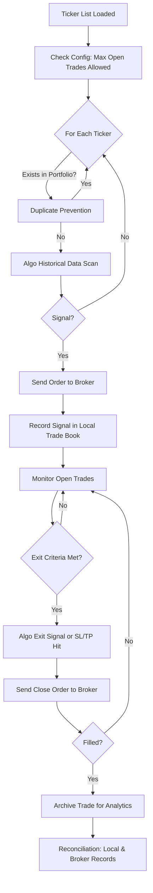

## 0. Setup & Broker Connectivity (Automated/Guided)

### 0.1 Broker API Discovery & Connection
1. User supplies broker name. System finds/validates API documentation and guides credential entry.
2. System tests connection, fetches sample data, and stores broker connection profile if successful. Prompts for manual URL if broker is unknown.

### 0.2 User Configuration for Trading
- Select tickers, strategy, and risk/position limits.
- Set up notifications/logging.
- Advise on compliance, if needed.

### 0.3 System Pre-Flight Check
- Run a connection/permission test and dry-run trade to validate before starting live trading.
- Reconcile supported order types, tickers, etc.

## Trade Monitoring, Reconciliation & Audit
* All system trades logged locally with timestamps and metadata.
* System regularly fetches broker and local trades for comparison.
* If trades exist in broker only, mark as “discovered/manual” and list in UI/report. Extra position (“broker: 3, local: 2”) triggers a discovered/manual entry for discrepancy.
* Allow user to annotate or adopt discovered/manual trades in the trade book.
* Track/reconcile both by trade records and by position (quantity per symbol).
* Notify user/admin only when mismatches persist or action is needed.

## Common Blockages & Routine Handling
- Broker API connection fails – prompt for new credentials/retry later.
- API rate limits – batch/sleep, alert if persistent.
- Manual trades at broker – flag as discovered/manual in UI.
- Partial fills/multi-leg orders – aggregate fills; prompt for review on mismatch.
- Temporary network/API outage – retry, alert if lasting.
- Small data differences – allow simple price/time tolerance in matching.

## Example User Reconciliation Table
| Symbol | Broker Pos | Local Pos | Discovered Manual | Local Only | Status |
|--------|------------|-----------|-------------------|------------|--------|
| AAPL   | 3          | 2         | 1                 | 0          | Imbalance |
| MSFT   | 0          | 0         | 0                 | 0          | Reconciled |

## Workflow Diagram

