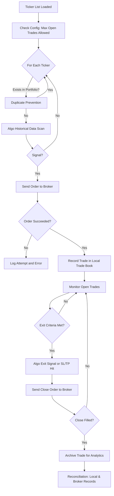

# TradingSystem Requirements

## Table of Contents

1. [Project Overview](#project-overview)
2. [Architectural Structure & Mode Separation](#architectural-structure--mode-separation)
3. [Setup & Broker Connectivity](#setup--broker-connectivity)
4. [User Configuration](#user-configuration)
5. [Mode Selection: Paper and Live](#mode-selection-paper-and-live)
6. [System Pre-Flight & Initialization](#system-pre-flight--initialization)
7. [Trade Monitoring, Reconciliation & Audit](#trade-monitoring-reconciliation--audit)
8. [Trade Recording Logic](#trade-recording-logic)
9. [Common Blockages & Routine Handling](#common-blockages--routine-handling)
10. [Example User Reconciliation Table](#example-user-reconciliation-table)
11. [Workflow Diagram](#workflow-diagram)
12. [Clarification on Trade Book Records](#clarification-on-trade-book-records)
13. [Lightweight Industrial-Grade Practices](#lightweight-industrial-grade-practices)
14. [Glossary](#glossary)

---

## 1. Project Overview

TradingSystem is designed to automate and monitor trading activities. It strictly separates paper (simulation) and live (production) modes for safe and scalable workflow.

---

## 2. Architectural Structure & Mode Separation

- The project **must** be structured into `/paper` and `/live` folders:
    - `/paper`: For simulation/backtesting only. No real trades sent.
    - `/live`: For production trading with real brokers and funds.
    - `/common` (or equivalent): For code/resources shared between the modes.
- Each mode shall have separate trade books, logs, and executions. No mixing of data.
- Only parameter sets proven and approved in paper mode may be promoted to live mode.

---

## 3. Setup & Broker Connectivity

### 0.1 Broker API Discovery & Connection
1. User supplies broker name. System finds/validates API documentation and guides credential entry.
2. System tests connection, fetches sample data, and stores broker connection profile if successful. Prompts for manual URL if broker is unknown.
- API credentials must be stored in encrypted form.

---

## 4. User Configuration

### 0.2 User Configuration for Trading
- Select tickers, strategy, and risk/position limits.
- Set up notifications/logging.
- Advise on compliance, if needed.

---

## 5. Mode Selection: Paper and Live

- User **must** choose "paper" or "live" at startup.
- All operations, logs, and books are kept separate by mode.
- The paper trading module only simulates fills (never sends real broker orders) and focuses on recording performance metrics.
- The live module executes actual trades using the broker API and only with parameter sets that have demonstrated acceptable results in paper mode.

---

## 6. System Pre-Flight & Initialization

### 0.3 System Pre-Flight Check
- Run a connection/permission test and dry-run trade to validate before starting live trading.
- Reconcile supported order types, tickers, etc.

---

## 7. Trade Monitoring, Reconciliation & Audit

- All system trades logged locally with timestamps and metadata.
- System regularly fetches broker and local trades for comparison.
- If trades exist in broker only, mark as “discovered/manual” and list in UI/report.
    - Extra position (“broker: 3, local: 2”) triggers a discovered/manual entry for discrepancy.
- Allow user to annotate or adopt discovered/manual trades in the trade book.
- Track/reconcile both by trade records and by position (quantity per symbol).
- Notify user/admin only when mismatches persist or action is needed.
- Write operations on trade logs and the trade book must be append-only (no silent modifications).
- All trade and log entries must use accurate, synchronized timestamps.

---

## 8. Trade Recording Logic

- After sending an order to the broker, the system MUST check the broker’s response.
- Only orders confirmed as “filled” or “succeeded” by the broker are recorded in the local trade book.
- Any order attempt that is not successful (e.g., rejected, failed, timeout) MUST be logged with the broker’s response and error, and MUST NOT update or create an entry in the local trade book.
- This ensures the local trade book always accurately reflects only actual, broker-confirmed trades.
- Each trade/order must include a unique idempotency key to prevent accidental duplicates.
- After submitting an order, persist its submission status until a broker “filled/succeeded” response is received and logged.

---

## 9. Common Blockages & Routine Handling

- Broker API connection fails – prompt for new credentials/retry later.
- API rate limits – batch/sleep, alert if persistent.
- Manual trades at broker – flag as discovered/manual in UI.
- Partial fills/multi-leg orders – aggregate fills; prompt for review on mismatch.
- Temporary network/API outage – retry, alert if lasting.
- Small data differences – allow simple price/time tolerance in matching.
- A manual kill-switch must be available to halt trading immediately if needed.
- If a trade attempt is far outside normal ranges (“fat finger”), system must reject it or require extra confirmation.
- Important events (broker disconnect, failed order, risk breach) must generate an alert or visible UI warning.

---

## 10. Example User Reconciliation Table

| Symbol | Broker Pos | Local Pos | Discovered Manual | Local Only | Status      |
|--------|------------|-----------|-------------------|------------|-------------|
| AAPL   | 3          | 2         | 1                 | 0          | Imbalance   |
| MSFT   | 0          | 0         | 0                 | 0          | Reconciled  |

---

## 11. Workflow Diagram

---

## 12. Clarification on Trade Book Records

- The local trade book records only trades that have been successfully executed and accepted by the broker (e.g., filled or confirmed trades).
- Failed or rejected trade attempts are not recorded in the local trade book, but are logged separately for audit and troubleshooting purposes.
- Logging must include all trade submission attempts, responses, and reasons for failure, but only successful trades update the trade book, trigger monitoring, or enter reconciliation routines.

---

## 13. Lightweight Industrial-Grade Practices

- API credentials must be encrypted.
- All logs and trade book updates are append-only and timestamped.
- Unique idempotency key on all orders to prevent race condition and replay.
- Paper/live split in logic, records, deployment.
- Manual kill switch available in live mode.
- Fat-finger checks present on all order entry.

---

## 14. Glossary

- **Paper Trading**: Simulation mode, no real trades, used for analytics and strategy validation.
- **Live Trading**: Real trades, risk automation, and alerting with broker integration.
- **Idempotency Key**: A unique identifier for each order to prevent duplicate execution.
- **Trade Book**: The official record of executed trades—must be separate for each mode.
- **Fat-finger check**: Protection against trades entered far outside reasonable sizes or prices.

---

> **Note:** 
> Every section above contains your original content, just rearranged for clarity and easier referencing.  
> No data or requirements are skipped or deleted—your detail remains intact, and all future contributors or reviewers have a clear navigational path.
