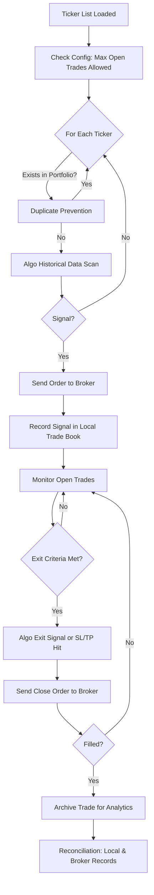

## Workflow Diagram

```mermaid
flowchart TD
    A[Ticker List Loaded] --> X[Check Config: Max Open Trades Allowed]
    X --> B{For Each Ticker}
    B --> |"Exists in Portfolio?"| C[Duplicate Prevention]
    C --> |"Yes"| B
    C --> |"No"| D[Algo Historical Data Scan]
    D --> E{Signal?}
    E --> |"No"| B
    E --> |"Yes"| F[Send Order to Broker]
    F --> G[Record Signal in Local Trade Book]
    G --> H[Monitor Open Trades]
    H --> I{Exit Criteria Met?}
    I --> |"No"| H
    I --> |"Yes"| J[Algo Exit Signal or SL/TP Hit]
    J --> K[Send Close Order to Broker]
    K --> L{Filled?}
    L --> |"No"| H
    L --> |"Yes"| M[Archive Trade for Analytics]
    M --> N[Reconciliation: Local & Broker Records]
```

